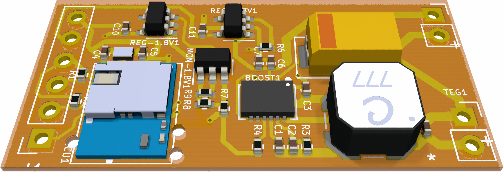

# TEG Sense Board

This is a thermoelectric generator (TEG) boost converter used to power a connected battery or capacitor to periodically operate a microcontroller reading from a biometric sensor to compute blood oxygen saturation. That was a big sentence!

This is the second iteration of the TEGSense board, with some schematic fixes and redesigned for a smaller flex board with bigger contacts for easy printing of conductive traces.
It is intended to be connected to a print-friendly version of the [SpO2 board](https://github.com/TEGSense/hardware-spo2-flex) and a [flex capacitor bank](https://github.com/TEGSense/hardware-flex-capboard).

## License

Shield: [![CC BY-SA 4.0][cc-by-sa-shield]][cc-by-sa]

This work is licensed under a
[Creative Commons Attribution-ShareAlike 4.0 International License][cc-by-sa].

[![CC BY-SA 4.0][cc-by-sa-image]][cc-by-sa]

[cc-by-sa]: http://creativecommons.org/licenses/by-sa/4.0/
[cc-by-sa-image]: https://licensebuttons.net/l/by-sa/4.0/88x31.png
[cc-by-sa-shield]: https://img.shields.io/badge/License-CC%20BY--SA%204.0-lightgrey.svg
